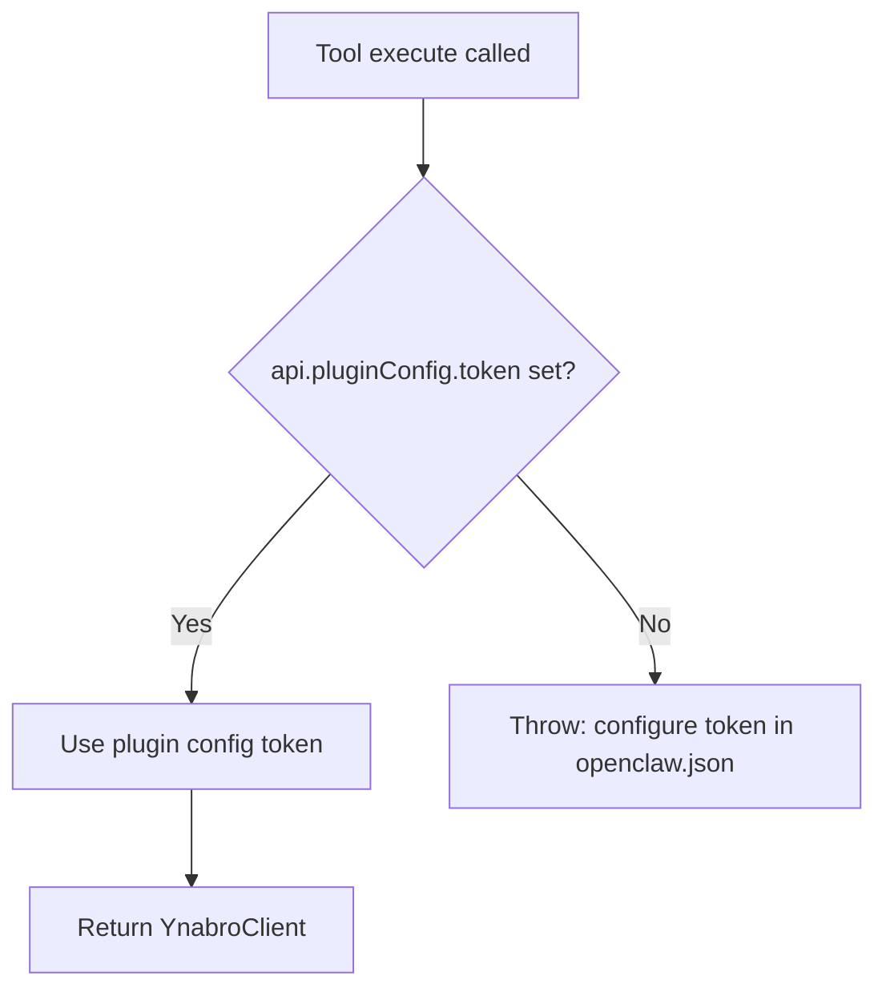
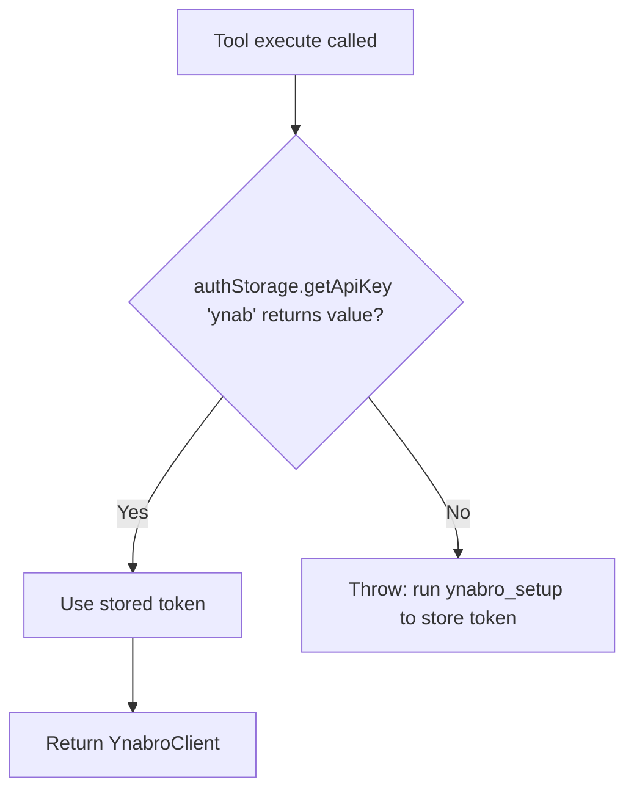

## Task 6: Documentation — all READMEs, `docs/TOOLS.md`, `docs/ARCHITECTURE.md`

**Prerequisite:** All code tasks (1–3) complete. Review the final state of the source files before writing documentation — especially `packages/openclaw-ynabro/src/index.ts` and `packages/pi-ynabro/src/index.ts`.

## Scope

**In scope:**
- `README.md` (repo root)
- `packages/openclaw-ynabro/README.md`
- `packages/pi-ynabro/README.md`
- `docs/TOOLS.md`
- `docs/ARCHITECTURE.md`

**Not in scope:** Source code, tests, CI

## What to implement

### `README.md` (repo root)

The Quick Start example currently shows:
```ts
const client = new YnabroClient(process.env.YNAB_TOKEN!);
const pending = await getPendingTransactions(client, planId);
await approveTransaction(client, planId, transactionId);
```

Update to reflect that `planId` is now stored — callers don't pass it per-call. Add a brief note explaining `YnabroConfigAdapter` and `setupYnab` for library consumers:

```ts
import { YnabroClient, setupYnab, getPendingTransactions, approveTransaction } from 'ynabro';
import type { YnabroConfigAdapter } from 'ynabro';

// 1. Implement the adapter for your platform's config system
const adapter: YnabroConfigAdapter = {
  getDefaultPlanId: async () => /* read from your config */ undefined,
  setDefaultPlanId: async (id) => { /* write to your config */ },
};

// 2. One-time setup: fetch plans, let the user select, then store
const client = new YnabroClient(token);
const plans = await client.getPlans();
await setupYnab(client, plans, selectedPlanId, adapter);

// 3. Subsequent calls — no planId needed in the adapter layer
const pending = await getPendingTransactions(client, await adapter.getDefaultPlanId()!);
```

Keep the badges, philosophy section, and links to docs unchanged.

---

### `packages/openclaw-ynabro/README.md`

**Available Tools** — add `ynabro_save_default_plan` after `ynabro_setup`:
```
- `ynabro_setup`
- `ynabro_save_default_plan`
- `ynabro_get_pending_transactions`
...
```

**Configuration section** — currently describes two resolution methods (plugin config + env var fallback). Replace entirely with:

> Set your YNAB Personal Access Token in `openclaw.json`:
>
> ```json
> {
>   "plugins": {
>     "entries": {
>       "openclaw-ynabro": {
>         "config": {
>           "token": "your-ynab-personal-access-token"
>         }
>       }
>     }
>   }
> }
> ```
>
> OpenClaw also surfaces this as a sensitive field in its settings UI (labeled "YNAB Personal Access Token"). Generate a token at https://app.ynab.com/settings/developer.
>
> No environment variable fallback is supported.

**Add Onboarding section** (after Configuration):

> ## Onboarding
>
> Run `ynabro_setup` to fetch your available YNAB plans, then `ynabro_save_default_plan` with the plan ID you want to use as the default:
>
> 1. `ynabro_setup` — returns `{ plans: [{ id, name }] }`
> 2. User (or agent) selects a plan from the list
> 3. `ynabro_save_default_plan` with `{ planId: "<selected-id>" }` — persists the default
>
> After onboarding, all plan-dependent tools (`ynabro_get_pending_transactions`, `ynabro_get_recent_transactions`, `ynabro_approve_transaction`, `ynabro_get_plan_info`) resolve the plan automatically — no `planId` parameter required.

---

### `packages/pi-ynabro/README.md`

**Requirements section** — replace:
> `YNAB_TOKEN` environment variable must be set

With:
> Run `ynabro_setup` once to complete onboarding. The tool will prompt you for your YNAB Personal Access Token (generate one at https://app.ynab.com/settings/developer) and let you select your default plan. Both are stored securely in pi's `AuthStorage` (`~/.pi/agent/auth.json`).

**Available Tools** — this package uses a single-step setup; no `ynabro_save_default_plan`. Tools list stays the same.

---

### `docs/TOOLS.md`

**Authentication section** — replace current text with:

> All tools that call the YNAB API require a valid Personal Access Token.
>
> - **`openclaw-ynabro`**: Token is resolved exclusively from `plugins.entries.openclaw-ynabro.config.token` in `openclaw.json`. No environment variable fallback.
> - **`pi-ynabro`**: Token is stored in pi's `AuthStorage` (`~/.pi/agent/auth.json`) after running `ynabro_setup`.
>
> Tools that do not require a token: `ynabro_get_skill_state`, `ynabro_update_skill_state` (local state only).

**Add `ynabro_setup` entry** that distinguishes platform behavior:

> ## ynabro_setup
>
> **OpenClaw:** Fetches available YNAB plans and returns them for selection. Requires token configured in `openclaw.json`. Returns `{ plans: [{ id: string, name: string }] }`. Call `ynabro_save_default_plan` next to complete onboarding.
>
> **pi:** Interactive one-step onboarding. Prompts for a YNAB Personal Access Token (if not already stored) and presents a plan selector. Stores both in pi's AuthStorage. No follow-up call required.

**Add `ynabro_save_default_plan` entry** (OpenClaw only):

> ## ynabro_save_default_plan *(OpenClaw only)*
>
> Saves a plan as the default for all subsequent tool calls. Call `ynabro_setup` first to get the list of valid plan IDs.
>
> **Parameters:**
> - `planId` (string) — The plan ID to set as default (from `ynabro_setup` results)
>
> **Returns:** `{ message: string, defaultPlanId: string }`
>
> Persists `defaultPlanId` to `plugins.entries.openclaw-ynabro.config.defaultPlanId` in `openclaw.json`.

**Plan-dependent tools** (`getPendingTransactions`, `getRecentTransactions`, `approveTransaction`, `getPlanInfo`) — add to each description:

> The plan ID is resolved automatically from the stored default. No `planId` parameter is required or accepted.

---

### `docs/ARCHITECTURE.md`

**Token resolution section** — replace the two-path flowchart with separate diagrams for each adapter:

**OpenClaw:**


**pi:**


Remove the "corrected in issue #32" paragraph at the end of the architecture doc.

**Add `YnabroConfigAdapter` section** after the token resolution section:

> ## YnabroConfigAdapter
>
> The core `ynabro` library exports a platform-agnostic config adapter interface:
>
> ```ts
> interface YnabroConfigAdapter {
>   getDefaultPlanId(): Promise<string | undefined>;
>   setDefaultPlanId(planId: string): Promise<void>;
> }
> ```
>
> Each platform adapter implements this interface to store and retrieve the default plan ID in the platform's native config system:
>
> | Adapter | Storage mechanism |
> |---|---|
> | `pi-ynabro` | pi `AuthStorage` (`~/.pi/agent/auth.json`), key `"ynab-plan"` |
> | `openclaw-ynabro` | `api.runtime.config.mutateConfigFile` → `plugins.entries.openclaw-ynabro.config.defaultPlanId` |
>
> `setupYnab(client, plans, selectedPlanId, adapter)` in core validates that `selectedPlanId` is present in the provided `plans` list and delegates storage to the adapter. Each adapter's `ynabro_setup` tool is responsible for fetching plans, handling user selection, and invoking `setupYnab` — only the storage step is shared.
>
> This design prevents platform-specific config logic from leaking into the core library and ensures both adapters behave consistently while storing config in the right place for each runtime.

**Update System Overview diagram** if it references `setupYnab` or onboarding flow — update to reflect that setup now flows through the adapter layer.

## Definition of Done

- All five files updated as described
- `openclaw-ynabro/README.md` mentions `ynabro_save_default_plan` and two-step onboarding
- `pi-ynabro/README.md` no longer mentions `YNAB_TOKEN` env var requirement
- `docs/TOOLS.md` has separate auth descriptions for each adapter; includes `ynabro_save_default_plan`
- `docs/ARCHITECTURE.md` has separate token flowcharts per adapter; has `YnabroConfigAdapter` section; "corrected in issue #32" note is gone
- No source code or test files modified

## Verification

Manual review — confirm no stale references to `YNAB_TOKEN`, `planIdSchema`, `.ynabro/config.json`, or "corrected in issue #32" remain in any of the five files.
