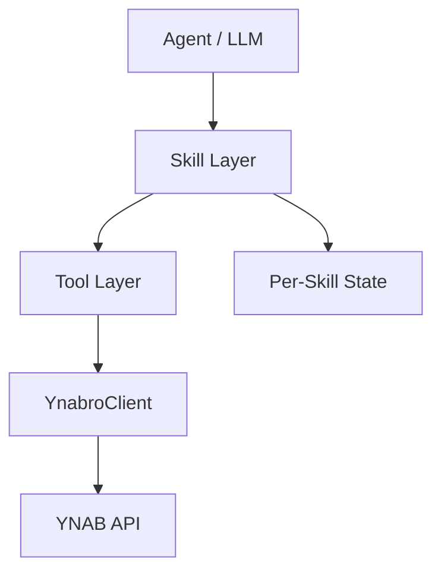
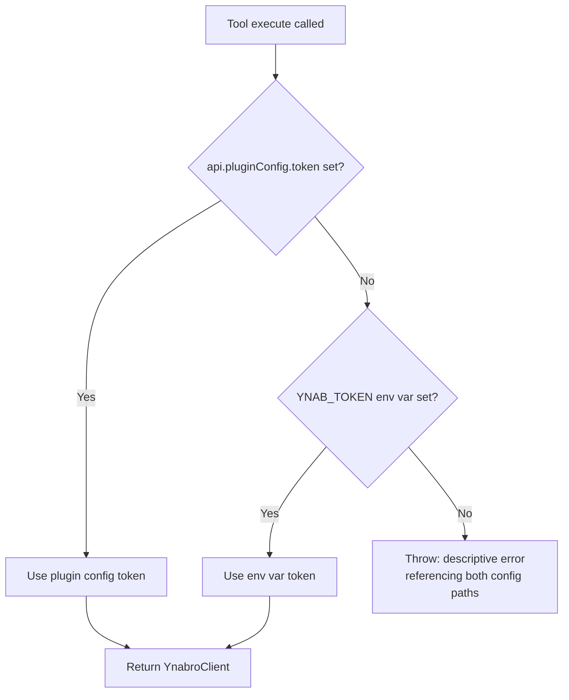

# ynabro Architecture

## Goals

- Provide a clean, typed interface for YNAB that is easy for LLMs to use.
- Abstract away awkward parts of the official YNAB SDK.
- Keep the library thin — intelligence lives in the agent, not in the client.
- Support per-skill isolated state and memory.

## System Overview



## Per-Skill State Model

Each skill maintains its own isolated state file:

```
.ynabro/skills/<skill-slug>/state.json
```

This design:
- Prevents state conflicts between skills
- Supports future private/personal skills
- Keeps memory portable and self-contained

Example state structure:

```json
{
  "last_knowledge_of_server": 123456,
  "auto_approve_enabled": false,
  "memory": []
}
```

- `last_knowledge_of_server`: Skill-specific delta cursor
- `auto_approve_enabled`: Per-skill auto-approval toggle
- `memory`: Flexible array for agent learning and patterns
```

## OpenClaw Adapter — Token Resolution

The `openclaw-ynabro` adapter resolves the YNAB Personal Access Token in the following order when `getClient()` is called:



Token is set by the user in one of two ways:
- `plugins.entries.openclaw-ynabro.config.token` in `openclaw.json` (primary — surfaced in OpenClaw settings UI as a sensitive field)
- `YNAB_TOKEN` environment variable (fallback — backwards-compatible)

> **Note:** The `ynabro_setup` tool uses a different code path (`setupYnab()` in the core library) and does not yet participate in this resolution order. This will be corrected in issue #32 when `setupYnab` is refactored to accept a `YnabroConfigAdapter`.