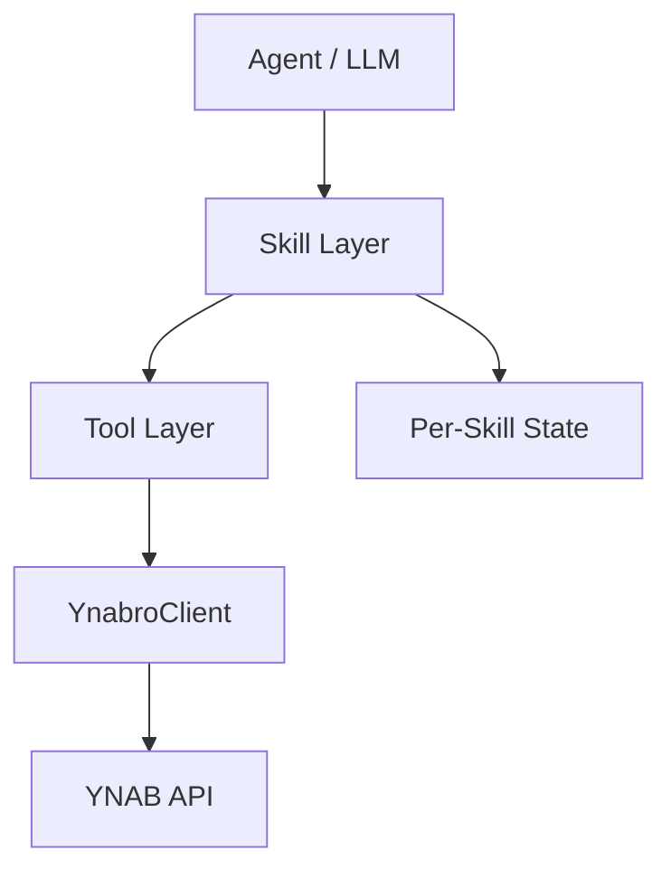
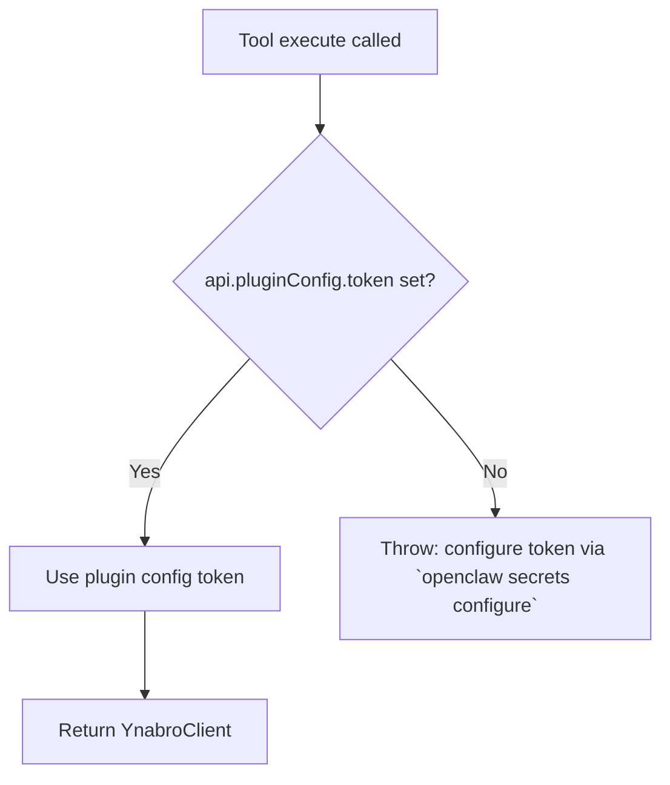
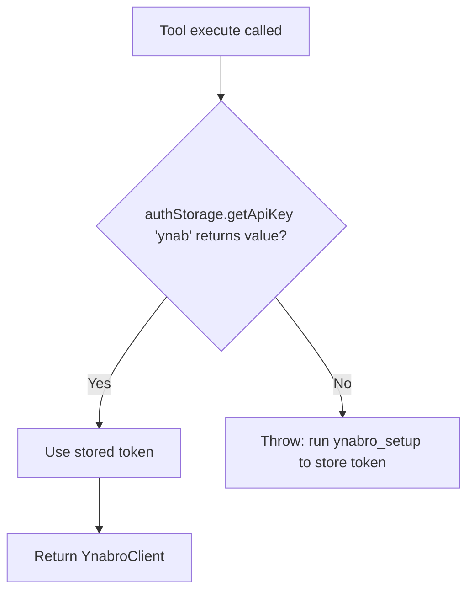

# ynabro Architecture

## Goals

- Provide a clean, typed interface for YNAB that is easy for LLMs to use.
- Abstract away awkward parts of the official YNAB SDK.
- Keep the library thin — intelligence lives in the agent, not in the client.
- Support per-skill isolated state and memory.

## System Overview



## Per-Skill State Model

Each skill maintains its own isolated state file:

```
.ynabro/skills/<skill-slug>/state.json
```

This design:
- Prevents state conflicts between skills
- Supports future private/personal skills
- Keeps memory portable and self-contained

Example state structure:

```json
{
  "last_knowledge_of_server": 123456,
  "auto_approve_enabled": false,
  "memory": []
}
```

- `last_knowledge_of_server`: Skill-specific delta cursor
- `auto_approve_enabled`: Per-skill auto-approval toggle
- `memory`: Flexible array for agent learning and patterns
```

## Efficiency Architecture (Rate Limits & Caching)

To stay within YNAB's 200 requests/hour limit, Ynabro implements:

- **Pluggable CacheStore**: `YnabroClient` accepts any `CacheStore` implementation.
  - `InMemoryCache` (default): Fast, session-scoped.
  - `FileBasedCache`: Portable across agents via `.ynabro/cache` directory.
- **Request Tracking**: Rolling 60-minute window tracking via `getRateLimitStatus()`.
- **Exponential Backoff**: Automatic retry on 429 responses.
- **Batch Updates**: `batchUpdateTransactions` uses a single PATCH call for multiple changes.

Agents and plugins should prefer `FileBasedCache` when running multiple agents on the same host to maximize cache hits.

## Token Resolution

### OpenClaw



### pi



## YnabroConfigAdapter

The core `ynabro` library exports a platform-agnostic config adapter interface:

```ts
interface YnabroConfigAdapter {
  getDefaultPlanId(): Promise<string | undefined>;
  setDefaultPlanId(planId: string): Promise<void>;
  hasToken(): Promise<boolean>;
}
```

Each platform adapter implements this interface to store and retrieve the default plan ID in the platform's native config system:

| Method | pi-ynabro | openclaw-ynabro |
|---|---|---|
| `getDefaultPlanId()` | pi `AuthStorage` (`~/.pi/agent/auth.json`), key `"ynab-plan"` | `api.runtime.config.mutateConfigFile` → `plugins.entries.openclaw-ynabro.config.defaultPlanId` |
| `setDefaultPlanId()` | pi `AuthStorage` (`~/.pi/agent/auth.json`), key `"ynab-plan"` | `api.runtime.config.mutateConfigFile` → `plugins.entries.openclaw-ynabro.config.defaultPlanId` |
| `hasToken()` | `!!(await authStorage.getApiKey("ynab"))` | `!!api.pluginConfig?.token` |

`setupYnab(client, plans, selectedPlanId, adapter)` in core validates that `selectedPlanId` is present in the provided `plans` list and delegates storage to the adapter. Each adapter's `ynabro_setup` tool is responsible for fetching plans, handling user selection, and invoking `setupYnab` — only the storage step is shared.

`checkOnboardingStatus(adapter)` uses the adapter to check both token presence (via `hasToken()`) and plan configuration (via `getDefaultPlanId()`), returning a structured `OnboardingStatus` object that indicates whether the integration is ready and what steps are missing.

This design prevents platform-specific config logic from leaking into the core library and ensures both adapters behave consistently while storing config in the right place for each runtime.

---

## Onboarding Detection

YNABro uses a two-layer strategy to detect when onboarding is needed:

**Layer 1 — Prompt-driven (proactive check):**
The `skills/ynabro/prompts/ynabro.md` prompt instructs the agent to call `ynabro_onboarding_status` before performing any YNAB operation. If the response indicates that configuration is incomplete (`ready: false`), the agent walks the user through onboarding before proceeding with the original request.

**Layer 2 — Structured error recovery (safety net):**
When a plan-dependent tool is called and configuration is missing, the tool returns a structured JSON response instead of throwing:

```json
{
  "error": "onboarding_required",
  "missing": ["token"],
  "message": "YNABro is not configured yet. Let's get you set up.",
  "tokenInstructions": "..."
}
```

This gives the agent a clear, parseable signal to initiate onboarding even if the proactive check was skipped.

**Why both layers?**
- Prompt-driven handles the happy path: the agent checks status proactively, onboards smoothly, then fulfills the request.
- Structured error handles edge cases: if the agent skips the proactive check (model reasoning variance, prompt not loaded, etc.) and calls a tool directly, it gets actionable recovery information instead of an opaque error.