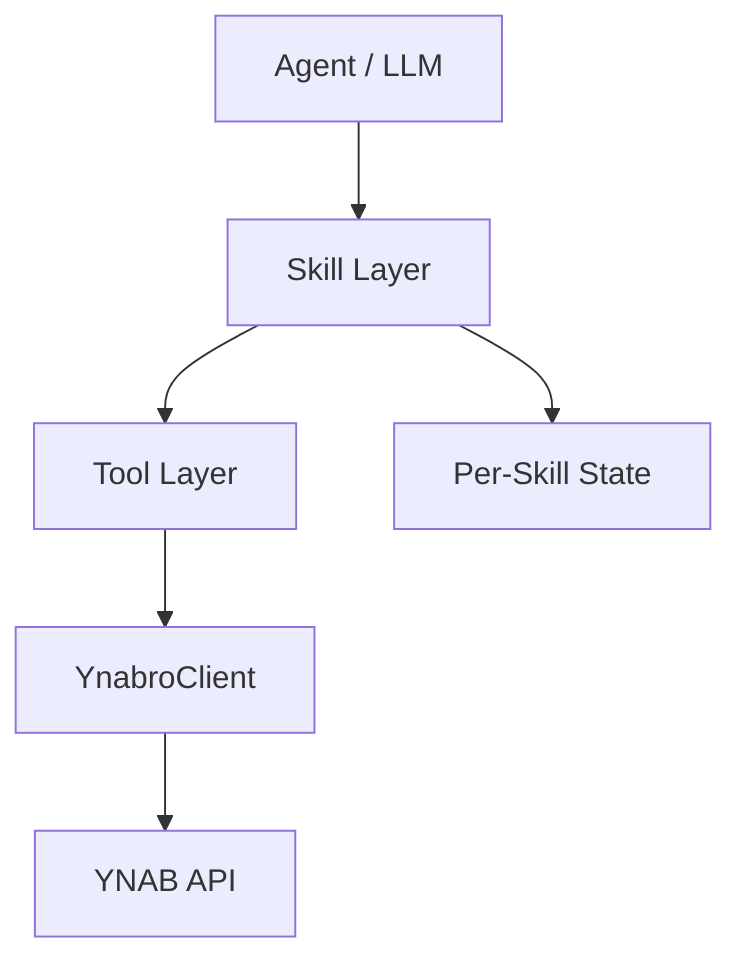

# ynabro Architecture

## Goals

- Provide a clean, typed interface for YNAB that is easy for LLMs to use.
- Abstract away awkward parts of the official YNAB SDK.
- Keep the library thin — intelligence lives in the agent, not in the client.
- Support per-skill isolated state and memory.

## System Overview



## Per-Skill State Model

Each skill maintains its own isolated state file:

```
.ynabro/skills/<skill-slug>/state.json
```

This design:
- Prevents state conflicts between skills
- Supports future private/personal skills
- Keeps memory portable and self-contained

Example state structure:

```json
{
  "last_knowledge_of_server": 123456,
  "auto_approve_enabled": false,
  "memory": []
}
```

- `last_knowledge_of_server`: Skill-specific delta cursor
- `auto_approve_enabled`: Per-skill auto-approval toggle
- `memory`: Flexible array for agent learning and patterns
```