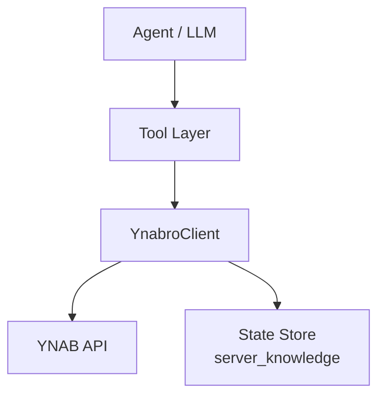

# ynabro Architecture

## Goals

- Provide a clean, typed interface for YNAB that is easy for LLMs to use.
- Abstract away awkward parts of the official YNAB SDK.
- Keep the library thin — intelligence lives in the agent, not in the client.

## System Overview

## Key Design Decisions

- Use the official `ynab` npm package internally
- Expose one tool per file for easy agent discovery
- Use "Plan" terminology publicly while mapping to YNAB's `budget` endpoints
- All behavioral logic lives in `skills/ynabro/prompts/`
