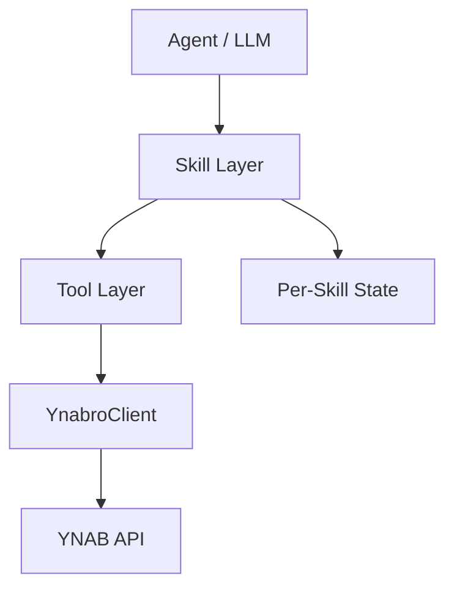
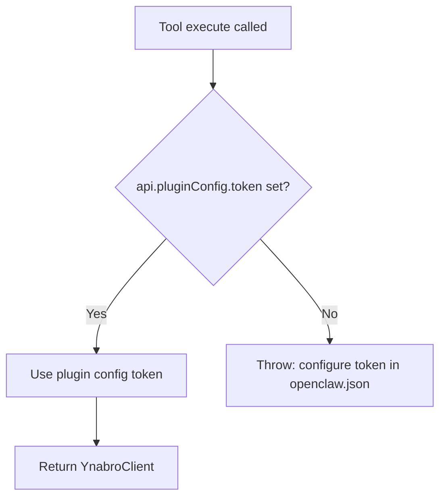
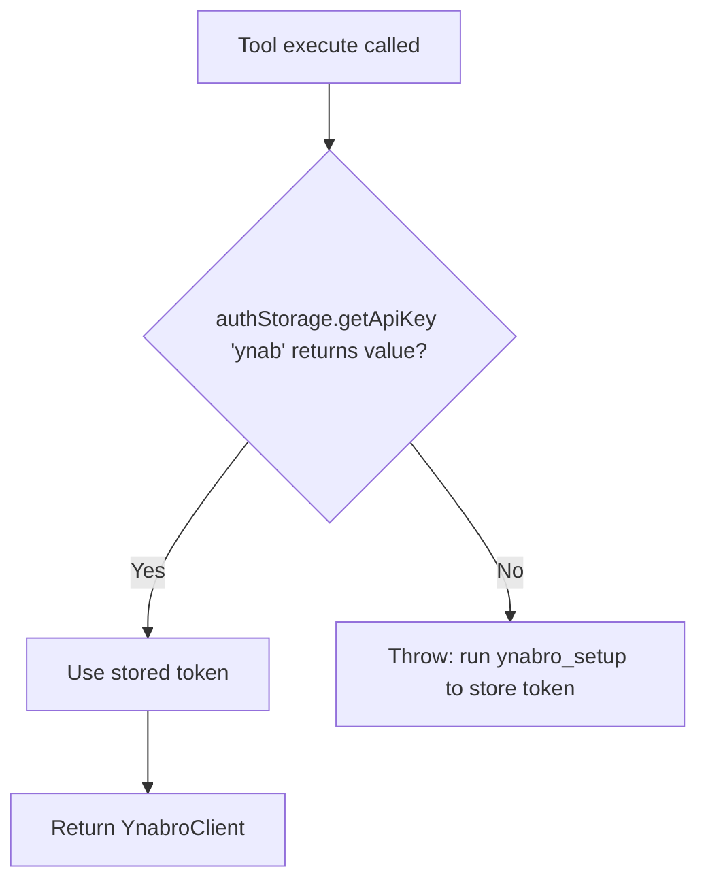

# ynabro Architecture

## Goals

- Provide a clean, typed interface for YNAB that is easy for LLMs to use.
- Abstract away awkward parts of the official YNAB SDK.
- Keep the library thin — intelligence lives in the agent, not in the client.
- Support per-skill isolated state and memory.

## System Overview



## Per-Skill State Model

Each skill maintains its own isolated state file:

```
.ynabro/skills/<skill-slug>/state.json
```

This design:
- Prevents state conflicts between skills
- Supports future private/personal skills
- Keeps memory portable and self-contained

Example state structure:

```json
{
  "last_knowledge_of_server": 123456,
  "auto_approve_enabled": false,
  "memory": []
}
```

- `last_knowledge_of_server`: Skill-specific delta cursor
- `auto_approve_enabled`: Per-skill auto-approval toggle
- `memory`: Flexible array for agent learning and patterns
```

## Token Resolution

### OpenClaw



### pi



## YnabroConfigAdapter

The core `ynabro` library exports a platform-agnostic config adapter interface:

```ts
interface YnabroConfigAdapter {
  getDefaultPlanId(): Promise<string | undefined>;
  setDefaultPlanId(planId: string): Promise<void>;
}
```

Each platform adapter implements this interface to store and retrieve the default plan ID in the platform's native config system:

| Adapter | Storage mechanism |
|---|---|
| `pi-ynabro` | pi `AuthStorage` (`~/.pi/agent/auth.json`), key `"ynab-plan"` |
| `openclaw-ynabro` | `api.runtime.config.mutateConfigFile` → `plugins.entries.openclaw-ynabro.config.defaultPlanId` |

`setupYnab(client, plans, selectedPlanId, adapter)` in core validates that `selectedPlanId` is present in the provided `plans` list and delegates storage to the adapter. Each adapter's `ynabro_setup` tool is responsible for fetching plans, handling user selection, and invoking `setupYnab` — only the storage step is shared.

This design prevents platform-specific config logic from leaking into the core library and ensures both adapters behave consistently while storing config in the right place for each runtime.