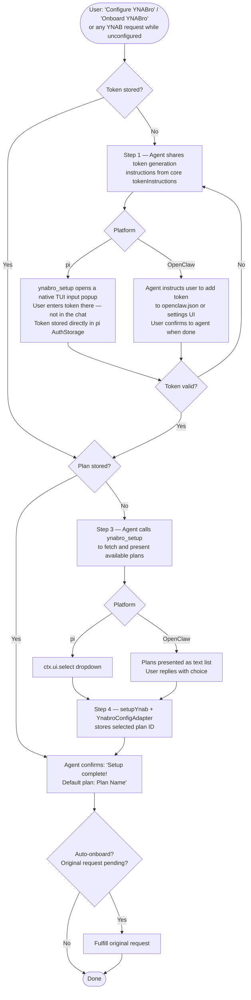

# YNABro Unified Onboarding — Conceptual Design

## 1. Overview

Today, onboarding is handled differently on each platform:

| Aspect | pi-ynabro | openclaw-ynabro |
|---|---|---|
| Token entry | Interactive prompt via `ctx.ui.input` inside `ynabro_setup` | Pre-configured in `openclaw.json` (manual or settings UI) |
| Plan selection | Interactive dropdown via `ctx.ui.select` inside `ynabro_setup` | Two-step: `ynabro_setup` returns list → `ynabro_save_default_plan` stores choice |
| Steps to complete | 1 tool call | 2 tool calls (+ manual config beforehand) |
| Unconfigured detection | Throws error string; agent receives it but has no structured recovery path | Throws error string; same limitation |
| Trigger | Agent must know to call `ynabro_setup` | Agent must know to call `ynabro_setup` |

**Goal:** Make onboarding feel like one coherent experience regardless of platform, and make the agent smart enough to start it automatically when it detects that configuration is missing.

---

## 2. Unified Onboarding Flow — User's Perspective

Regardless of platform, the user should experience these conceptual steps:



### Key UX Principle

After auto-onboard completes, the agent should **fulfill the user's original request** without making them repeat it. If the user said "show me my pending transactions" and onboarding kicked in, the agent should show the transactions after onboarding completes — not just say "you're set up now."

---

## 3. Auto-Onboard Detection

### 3.1 Current Problem

Today, when a tool is called without configuration, it throws:

```
pi:      "YNAB token not configured. Run ynabro_setup to complete onboarding."
OpenClaw: "YNAB token not configured. Set it via plugins.entries..."
         "No default plan configured. Run ynabro_setup then ynabro_save_default_plan..."
```

The agent receives this as a raw error string. Whether it recovers depends entirely on the LLM's reasoning and whatever the system prompt says. There's no structured signal, and the prompt instructions are incomplete.

### 3.2 Proposed: Structured Onboarding Status

Add a new function to the core library:

```ts
// packages/ynabro/src/tools/onboardingStatus.ts

interface OnboardingStatus {
  ready: boolean;
  missing: ('token' | 'plan')[];
  tokenInstructions: string;  // Static text: how to generate a YNAB PAT
}

function checkOnboardingStatus(adapter: YnabroConfigAdapter): Promise<OnboardingStatus>
```

This is **not a tool** — it's a helper that platform adapters call internally. Each adapter uses its own mechanism to check for the token, then delegates to this function for the planId check.

### 3.3 Two Detection Strategies (Layered)

**Layer 1 — Prompt-driven (skills layer):**
The `skills/ynabro/prompts/ynabro.md` prompt tells the agent:

> Before performing any YNAB operation, call `ynabro_onboarding_status` to check whether the integration is configured. If it reports any missing steps, walk the user through onboarding before proceeding with their request. Remember the user's original request and fulfill it after onboarding completes.

This gives the agent a proactive check to run at the start of any YNAB conversation.

**Layer 2 — Structured error recovery (tool layer):**
When a plan-dependent tool is called and configuration is missing, instead of throwing an opaque error, it returns a structured response:

```json
{
  "error": "onboarding_required",
  "missing": ["token"],
  "message": "YNABro is not configured yet. Let's get you set up.",
  "tokenInstructions": "Go to https://app.ynab.com/settings/developer ..."
}
```

This gives the agent a clear, parseable signal to initiate onboarding — even if the prompt-driven check was skipped.

### 3.4 Why Both Layers?

- **Prompt-driven** handles the happy path: agent checks status proactively at the start of a conversation, onboards smoothly, then fulfills the request.
- **Structured error** handles the edge case: agent skips the proactive check (model reasoning variance, prompt not loaded, etc.) and calls a tool directly. Instead of a cryptic error, it gets actionable recovery info.

Neither layer alone is sufficient. Prompt-driven alone fails when the LLM doesn't follow the instruction. Error-driven alone means the agent always fails first, then recovers — a worse UX.

---

## 4. Architecture Mapping

### 4.1 What Changes Where

```
packages/ynabro/              ← Core library
├── src/
│   ├── tools/
│   │   ├── onboardingStatus.ts    [NEW]  Core onboarding status checker
│   │   ├── setupYnab.ts           [MOD]  Extend YnabroConfigAdapter (see 4.2)
│   │   └── index.ts               [MOD]  Export new function + extended type
│   └── index.ts                   [MOD]  Re-export

packages/openclaw-ynabro/     ← OpenClaw adapter
├── src/
│   └── index.ts                   [MOD]  Add ynabro_onboarding_status tool;
│                                          update tool error handling;
│                                          extend adapter with hasToken()

packages/pi-ynabro/           ← Pi adapter
├── src/
│   └── index.ts                   [MOD]  Add ynabro_onboarding_status tool;
│                                          update tool error handling;
│                                          extend adapter with hasToken()

skills/ynabro/                ← Skill prompts
├── prompts/
│   └── ynabro.md                  [MOD]  Rewrite onboarding section with
│                                          unified flow + auto-detect instructions
```

### 4.2 Extending `YnabroConfigAdapter`

The current interface only handles plan ID:

```ts
interface YnabroConfigAdapter {
  getDefaultPlanId(): Promise<string | undefined>;
  setDefaultPlanId(planId: string): Promise<void>;
}
```

The interface is extended to add `hasToken()`:

```ts
interface YnabroConfigAdapter {
  getDefaultPlanId(): Promise<string | undefined>;
  setDefaultPlanId(planId: string): Promise<void>;
  hasToken(): Promise<boolean>;  // NEW — platform checks its own storage
}
```

`hasToken()` is a read-only check. It does NOT expose the token value to core — core doesn't need it. Each platform implements it against its own storage:

| Platform | `hasToken()` implementation |
|---|---|
| pi | `return !!(await authStorage.getApiKey("ynab"))` |
| OpenClaw | `return !!api.pluginConfig?.token` |

This is a breaking change to the interface, but only affects the two in-repo adapters — the risk is low and TypeScript will surface any adapter that does not implement it.

### 4.3 `ynabro_onboarding_status` — New Tool

Registered on both platforms. Takes no parameters. Returns:

```json
{
  "ready": true,
  "missing": [],
  "tokenInstructions": "..."
}
```

or:

```json
{
  "ready": false,
  "missing": ["token", "plan"],
  "tokenInstructions": "To generate a YNAB Personal Access Token:\n1. Go to https://app.ynab.com/settings/developer\n2. Click 'New Token'\n3. Enter your YNAB password\n4. Copy the token (it will only be shown once)",
  "nextStep": "Once you have your token, follow the platform-specific steps below to store it securely — do not paste it into this chat."
}
```

The static `tokenInstructions` text lives in core (single source of truth), not duplicated per adapter.

### 4.4 Tool Error Handling Changes

Currently, `getClient()` and `getDefaultPlanId()` throw on missing config. The change:

**Before:**
```ts
function getClient(): YnabroClient {
  const token = ...;
  if (!token) throw new Error("YNAB token not configured...");
  return new YnabroClient(token);
}
```

**After:**
```ts
function getClientOrOnboardingError(): YnabroClient | OnboardingRequired {
  const token = ...;
  if (!token) return { error: "onboarding_required", missing: ["token"], ... };
  return new YnabroClient(token);
}
```

Each plan-dependent tool checks the return type. If it's an onboarding error, it returns the structured response instead of proceeding. This is an internal refactor — the tool's external contract changes from "throws on error" to "returns structured error," which is better for LLM consumption anyway.

### 4.5 Skill Prompt Rewrite

The current `skills/ynabro/prompts/ynabro.md` has stale onboarding instructions (references `YNAB_TOKEN` env var, references `setupYnab()` as a single call). The rewrite:

```markdown
## Onboarding & Access

Before performing any YNAB operations, call `ynabro_onboarding_status` to check
whether YNAB access is configured.

If `ready` is `false`, walk the user through setup:

1. **Missing token:** Share the `tokenInstructions` from the status response.
   The token must never be entered into the chat.
   - **pi:** Call `ynabro_setup` — it presents a native TUI input popup where the
     user enters the token directly. It goes straight to pi's AuthStorage and
     never appears in the conversation.
   - **OpenClaw:** Instruct the user to add the token to `openclaw.json` or via
     the OpenClaw settings UI, then ask them to confirm when done.

2. **Missing plan:** Call `ynabro_setup` to list available plans. Help the user
   pick one. On OpenClaw, follow up with `ynabro_save_default_plan`.

3. **After onboarding completes:** If the user's original message was a functional
   request (e.g., "show my pending transactions"), fulfill it immediately.
   Don't make them repeat themselves.

If a tool returns an `onboarding_required` error during a conversation, treat it
the same as a failed status check — initiate onboarding, then retry the original
operation.
```

### 4.6 What Stays the Same

- `setupYnab()` core function — unchanged (validates planId, delegates to adapter)
- `ynabro_setup` tool on pi — unchanged (interactive one-step flow is already good)
- `ynabro_setup` tool on OpenClaw — unchanged (returns plan list)
- `ynabro_save_default_plan` tool on OpenClaw — unchanged
- Token storage mechanisms on both platforms — unchanged
- All plan-dependent tool logic — unchanged (only the error path changes)
- `YnabroClient` — unchanged
- `conformance.test.ts` — may need new assertions for `hasToken` and `ynabro_onboarding_status`

---

## 5. Detailed File Change Plan

### New Files

| File | Purpose |
|---|---|
| `packages/ynabro/src/tools/onboardingStatus.ts` | `checkOnboardingStatus()` function + `OnboardingStatus` type + static token instruction text |

### Modified Files

| File | Changes |
|---|---|
| `packages/ynabro/src/tools/setupYnab.ts` | Add `hasToken()` to `YnabroConfigAdapter` interface |
| `packages/ynabro/src/tools/index.ts` | Export `checkOnboardingStatus`, `OnboardingStatus` |
| `packages/ynabro/src/index.ts` | Re-export new symbols |
| `packages/openclaw-ynabro/src/index.ts` | (1) Add `hasToken()` to `openClawAdapter`; (2) Register `ynabro_onboarding_status` tool; (3) Refactor `getClient()`/`getDefaultPlanId()` to return structured errors |
| `packages/pi-ynabro/src/index.ts` | (1) Add `hasToken()` to `piConfigAdapter`; (2) Register `ynabro_onboarding_status` tool; (3) Refactor `getClient()`/`getDefaultPlanId()` to return structured errors |
| `skills/ynabro/prompts/ynabro.md` | Rewrite Onboarding & Access section; remove stale env var references |
| `packages/ynabro/tests/setupYnab.test.ts` | Add tests for `hasToken()` in adapter mock |
| `packages/ynabro/tests/conformance.test.ts` | Add assertions: both adapters implement `hasToken()`, both register `ynabro_onboarding_status` |
| `docs/TOOLS.md` | Add `ynabro_onboarding_status` entry; update onboarding flow description |
| `docs/ARCHITECTURE.md` | Add onboarding detection section; update `YnabroConfigAdapter` definition |
| `packages/openclaw-ynabro/openclaw.plugin.json` | Add `ynabro_onboarding_status` to `contracts.tools` |

### Unchanged Files

| File | Reason |
|---|---|
| `packages/ynabro/src/client/YnabroClient.ts` | No changes to the YNAB client |
| `packages/ynabro/src/tools/getPendingTransactions.ts` | Core tool functions don't change — error handling is in the adapter layer |
| `packages/ynabro/src/tools/getRecentTransactions.ts` | Same |
| `packages/ynabro/src/tools/approveTransaction.ts` | Same |
| `packages/ynabro/src/tools/getPlanInfo.ts` | Same |

---

## 6. Resolved Decisions

All seven design questions have been answered. They are recorded here for reference.

### Q1: `ynabro_onboarding_status` — Registered tool or internal-only?

**Decision: Registered tool.** The tool is registered on both platforms and callable by the agent. The prompt instructs the agent to call it proactively at the start of any YNAB conversation. This is the most reliable path because it works within the existing tool-calling contract and enables the proactive check that makes auto-onboard work without the agent having to fail first.

### Q2: Plan-dependent tools — Structured JSON errors or throw?

**Decision: Return structured JSON.** When configuration is missing, plan-dependent tools return `{ error: "onboarding_required", missing: [...], ... }` instead of throwing. LLMs parse structured JSON more reliably than error strings, and returning a tool result is a cleaner contract than throwing from a tool handler.

### Q3: OpenClaw token entry — Manual or tool-based?

**Decision: Keep manual.** The agent instructs the user to add the token to `openclaw.json` or via the OpenClaw settings UI. No tool-based token entry. The token must never transit through the chat. On pi, the token is collected via `ctx.ui.input` — a native TUI input popup that is not part of the conversation transcript — and stored directly in pi's `AuthStorage`. This is a security requirement, not a preference.

### Q4: `hasToken()` — On `YnabroConfigAdapter` or a separate interface?

**Decision: Extend `YnabroConfigAdapter`.** `hasToken()` is added to the existing interface. This keeps all configuration concerns on one adapter object. The only consumers are the two in-repo adapters, so the breaking change is low-risk. TypeScript will surface any adapter that does not implement it.

### Q5: Token generation instructions — In core or in the skill prompt?

**Decision: In core.** The static `tokenInstructions` text lives in `onboardingStatus.ts` and is returned by `checkOnboardingStatus()`. Both platforms get identical, accurate instructions from a single source. The skill prompt references this field rather than duplicating the content.

### Q6: Does `openclaw.plugin.json` need updating?

**Decision: Yes.** `ynabro_onboarding_status` is added to `contracts.tools` in `packages/openclaw-ynabro/openclaw.plugin.json`. See Section 5 (Modified Files).

### Q7: Re-onboarding / reconfiguration — Full validation or presence-check?

**Decision: Presence-check only in Phase 1.** `hasToken()` returns `true` if a token value is stored, regardless of whether it is currently valid. Token validation happens naturally when the user makes their first real request — if the stored token has expired or been revoked, the YNAB API returns an error and the agent can suggest re-running setup. A `validateToken()` method on the adapter is deferred to a future phase.

---

## 7. Summary of Design Decisions

| Decision | Choice | Rationale |
|---|---|---|
| Onboarding status tool | Registered tool on both platforms | Enables proactive checking; most reliable for LLMs |
| Error format | Structured JSON returns, not throws | LLMs parse JSON more reliably than error strings |
| Token entry on OpenClaw | Manual (instructions-based) | Security — token shouldn't transit through chat |
| `hasToken()` location | On `YnabroConfigAdapter` | Keeps all config concerns on one interface |
| Token instructions location | In core (`onboardingStatus.ts`) | Single source of truth across platforms |
| Token validation | Presence-only in Phase 1 | Real validation happens on first API call naturally |
| Adapter interface change | Breaking (add `hasToken()`) | Only 2 in-repo consumers; low risk |
