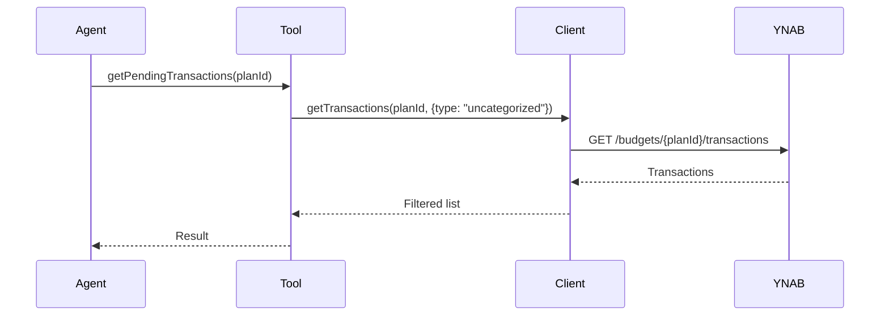
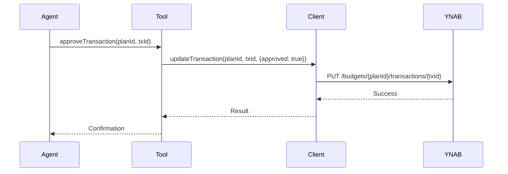

# YNABro Tools Reference

This document describes all available tools in the `ynabro` library.

## Authentication

All tools that call the YNAB API require a valid Personal Access Token.

- **`openclaw-ynabro`**: Token is resolved exclusively from `plugins.entries.openclaw-ynabro.config.token`. That path is registered as a SecretRef-eligible surface, so the recommended setup is `openclaw secrets configure` (or `openclaw config set plugins.entries.openclaw-ynabro.config.token --ref-source env|file|exec --ref-provider <provider> --ref-id <id>`). Plaintext in `openclaw.json` is supported but flagged by `openclaw secrets audit`. The plugin itself has no environment-variable fallback; use an `env` SecretRef if you want env-backed storage.
- **`pi-ynabro`**: Token is stored in pi's `AuthStorage` (`~/.pi/agent/auth.json`) after running `ynabro_setup`.

Tools that do **not** require a token: `ynabro_get_skill_state`, `ynabro_update_skill_state` (local state only).

When configuration is missing, plan-dependent tools return a structured error response:

```json
{
  "error": "onboarding_required",
  "missing": ["token"],
  "message": "YNABro is not configured yet. Let's get you set up.",
  "tokenInstructions": "To generate a YNAB Personal Access Token:\n..."
}
```

## YnabroClient

Core client for interacting with the YNAB API.

### Methods

- `getPlans()` — Retrieve all plans for the user
- `getTransactions(planId, options?)` — Get transactions with optional filtering
- `updateTransaction(planId, transactionId, patch)` — Update a transaction

---

## ynabro_onboarding_status

Checks whether YNAB access is fully configured. Available on both platforms.

**Parameters:** None

**Returns:** `OnboardingStatus` JSON:

```ts
{
  ready: boolean;             // true if both token and plan are configured
  missing: string[];          // Array of "token" and/or "plan" if incomplete
  tokenInstructions: string;  // Static instructions for generating a YNAB PAT
  nextStep?: string;          // Human-readable next step (present only when ready: false)
}
```

**Usage:**
The agent should call this proactively before any YNAB operation to detect whether onboarding is needed. If `ready` is `false`, walk the user through setup using the platform-specific flow described in the skill prompt.

---

## ynabro_setup

**OpenClaw:** Fetches available YNAB plans and returns them for selection. Requires the token to be configured at `plugins.entries.openclaw-ynabro.config.token` (preferably via `openclaw secrets configure`). Returns `{ plans: [{ id: string, name: string }] }`. Call `ynabro_save_default_plan` next to complete onboarding.

**pi:** Interactive one-step onboarding. Prompts for a YNAB Personal Access Token (if not already stored) and presents a plan selector. Stores both in pi's AuthStorage. No follow-up call required.

---

## ynabro_save_default_plan *(OpenClaw only)*

Saves a plan as the default for all subsequent tool calls. Call `ynabro_setup` first to get the list of valid plan IDs.

**Parameters:**
- `planId` (string) — The plan ID to set as default (from `ynabro_setup` results)

**Returns:** `{ message: string, defaultPlanId: string }`

Persists `defaultPlanId` to `plugins.entries.openclaw-ynabro.config.defaultPlanId` in `openclaw.json`.

---

## getPendingTransactions

**Primary tool for reviewing transactions that need attention.**

```ts
getPendingTransactions(client: YnabroClient, planId: string): Promise<YnabTransaction[]>
```

Returns all unapproved transactions for the given plan.

The plan ID is resolved automatically from the stored default. No `planId` parameter is required or accepted.



---

## getRecentTransactions

```ts
getRecentTransactions(client: YnabroClient, planId: string): Promise<YnabTransaction[]>
```

Returns recent transactions (approved + pending).

The plan ID is resolved automatically from the stored default. No `planId` parameter is required or accepted.

---

## approveTransaction

**Use only after high-confidence matching or explicit user approval.**

```ts
approveTransaction(client: YnabroClient, planId: string, transactionId: string): Promise<void>
```

Approves a specific transaction.

The plan ID is resolved automatically from the stored default. No `planId` parameter is required or accepted.



---

## getPlanInfo

```ts
getPlanInfo(client: YnabroClient, planId: string): Promise<YnabPlan | undefined>
```

Returns basic metadata for a specific plan.

The plan ID is resolved automatically from the stored default. No `planId` parameter is required or accepted.
