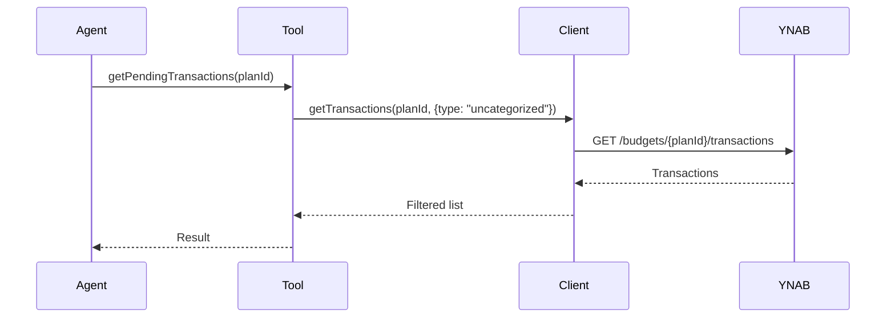
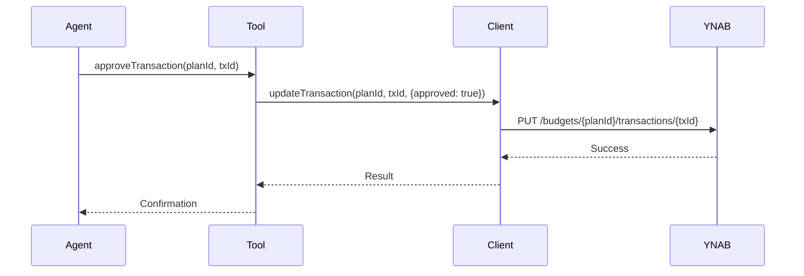

# YNABro Tools Reference

This document describes all available tools in the `ynabro` library.

## YnabroClient

Core client for interacting with the YNAB API.

### Methods

- `getPlans()` — Retrieve all plans for the user
- `getTransactions(planId, options?)` — Get transactions with optional filtering
- `updateTransaction(planId, transactionId, patch)` — Update a transaction

---

## getPendingTransactions

**Primary tool for reviewing transactions that need attention.**

```ts
getPendingTransactions(client: YnabroClient, planId: string): Promise<YnabTransaction[]>
```

Returns all unapproved transactions for the given plan.



---

## getRecentTransactions

```ts
getRecentTransactions(client: YnabroClient, planId: string): Promise<YnabTransaction[]>
```

Returns recent transactions (approved + pending).

---

## approveTransaction

**Use only after high-confidence matching or explicit user approval.**

```ts
approveTransaction(client: YnabroClient, planId: string, transactionId: string): Promise<void>
```

Approves a specific transaction.



---

## getPlanInfo

```ts
getPlanInfo(client: YnabroClient, planId: string): Promise<YnabPlan | undefined>
```

Returns basic metadata for a specific plan.
