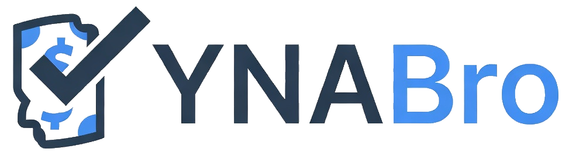

<p align="center">
  <a href="https://www.npmjs.com/package/openclaw-ynabro"></a>
  <a href="https://github.com/jmcombs/ynabro/blob/main/LICENSE"></a>
  <a href="https://github.com/sponsors/jmcombs"></a>
</p>

# openclaw-ynabro

OpenClaw plugin that registers [ynabro](https://www.npmjs.com/package/ynabro) tools for YNAB integration.

## Installation

```bash
openclaw plugins install openclaw-ynabro
```

## Available Tools

- `ynabro_setup`
- `ynabro_save_default_plan`
- `ynabro_get_pending_transactions`
- `ynabro_get_recent_transactions`
- `ynabro_approve_transaction`
- `ynabro_get_plan_info`
- `ynabro_get_skill_state`
- `ynabro_update_skill_state`

## Configuration

Set your YNAB Personal Access Token in `openclaw.json`:

```json
{
  "plugins": {
    "entries": {
      "openclaw-ynabro": {
        "config": {
          "token": "your-ynab-personal-access-token"
        }
      }
    }
  }
}
```

OpenClaw also surfaces this as a sensitive field in its settings UI (labeled "YNAB Personal Access Token"). Generate a token at https://app.ynab.com/settings/developer.

No environment variable fallback is supported.

## Onboarding

Run `ynabro_setup` to fetch your available YNAB plans, then `ynabro_save_default_plan` with the plan ID you want to use as the default:

1. `ynabro_setup` — returns `{ plans: [{ id, name }] }`
2. User (or agent) selects a plan from the list
3. `ynabro_save_default_plan` with `{ planId: "<selected-id>" }` — persists the default

After onboarding, all plan-dependent tools (`ynabro_get_pending_transactions`, `ynabro_get_recent_transactions`, `ynabro_approve_transaction`, `ynabro_get_plan_info`) resolve the plan automatically — no `planId` parameter required.
